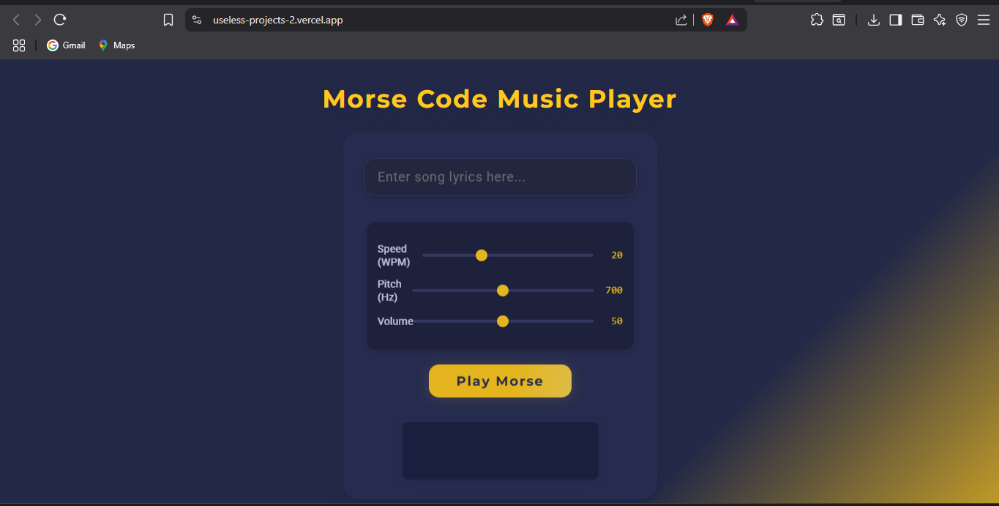
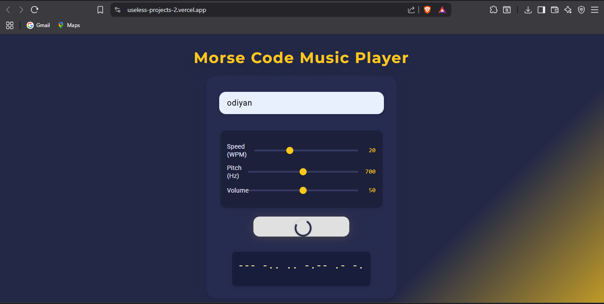
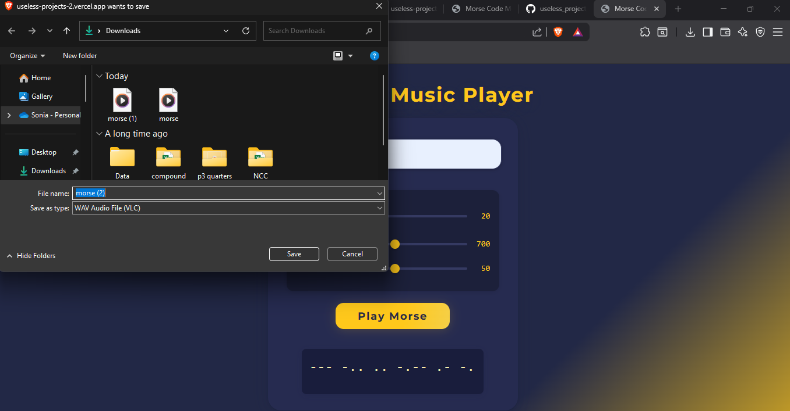



### Morse Code Music Player

Turn any text to Morse Code, instantly! Adjust the speed, pitch or volume and have fun with your Morse messages.

### Team Name: Sambhar

### Team Members
- Team Lead: Anjali Krishna - Government Model Engineering College
- Member 2: Drishya Ajith - Government Model Engineering College

### Project Description
This tool lets you type in any text and see it converted into Morse code, both visually and with sound. You can adjust settings like speed, pitch, or volume to customize how the Morse code plays. It’s handy for experimenting, learning, or just having some fun with Morse messages.

### The Problem (that doesn't exist)
For people who can't see, they wouldn't know what they are typing. So this tool could be used to guide and keep track of what they are typing and know whether or not it makes sense.

### The Solution (that nobody asked for)
We could listen to what we type.

## Technical Details
### Technologies/Components Used
For Software:
- JavaScript, HTML, CSS
- Vanilla JS

For Hardware:
- Nil

### Implementation
For Software: 
- JavaScript, HTML, CSS
- Vanilla JS

# Installation
Just clone the repo and open the index.html file :/
Or just visit https://useless-projects-2.vercel.app/

# Run
Just visit https://useless-projects-2.vercel.app/

### Project Documentation
For Software:

# Screenshots (Add at least 3)

## Team Contributions
- Anjali Krishna: Development
- Drishya Ajith: Design and deployment

---
Made with ❤️ at TinkerHub Useless Projects 

